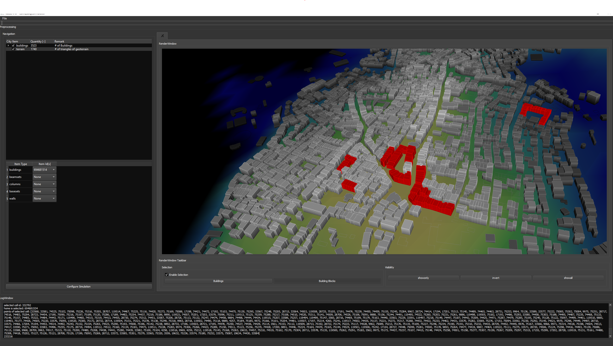
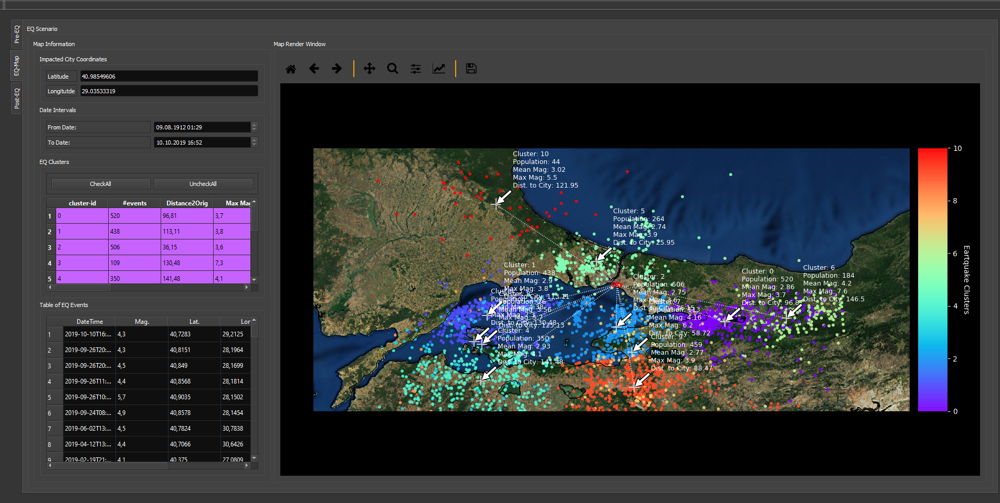
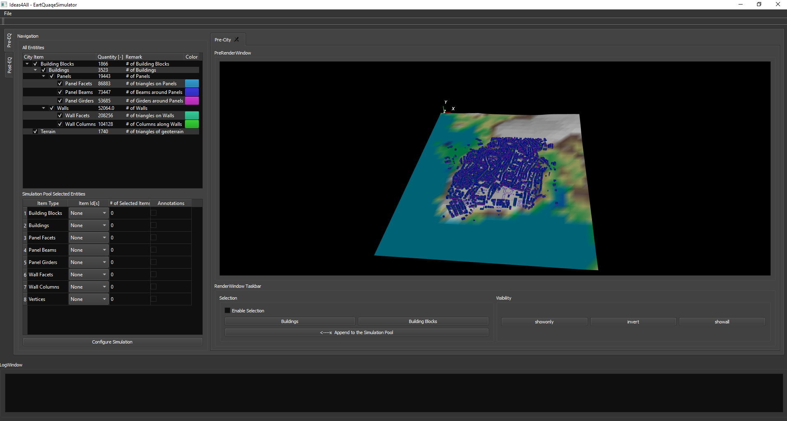
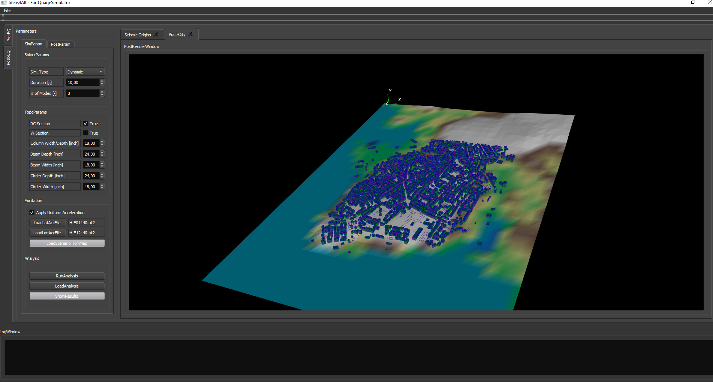

# 3dCity_LOD1_rep

This is most probably the ugliest readme you have ever read in your live. 

For more uglier cases, you can check my other repos. 

The rep of a 3d representation of a city and earthquake simulations above it.

The case is build upon a real case, the database was pulled from public sources such as openstreetmap. 

Feel free to ask questions, the project was cut before it had been born. Kudos goes to the buddy-developer: https://github.com/sadilak85

The project is under construction, pull, read, understand and improve as you wish. A couple of snapshots: 

